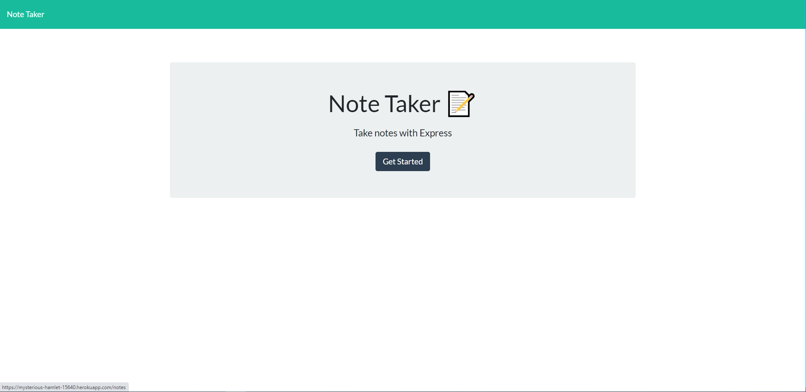

# note-taker

## Description 

This project designed a note taking app that stores notes on the Heroku server. The goal of this project was to practice API routes using Express.js and some built-in Node packages like "path" and "fs". The application of connecting user inputs to the server can be translated to many other applications. Get, post, and delete routes are all implemented in this project. 

## Table of Contents 

* [Installation](#installation)
* [Usage](#usage)
* [Credits](#credits)
* [License](#license)

## Installation

To install the project files, you can clone the "note-taker" repository which contains the necessary files at https://github.com/jgarcia60/note-taker by clicking the green drop down "Code" and cloning the repo with an SSH key. To run the command line interface app, you will need to run "node server.js" or "nodemon server.js" in the correct directory in your terminal to test out the code in your local host. Then your created team profile html will be generated in the "output" folder.

## Usage 

You may store your own notes in this easy-to-use app, as well as use the code here as a working example of how to connect Get, Post, and Delete Routes with Express.js

To use the note app, go to https://mysterious-hamlet-15640.herokuapp.com/

This is what it looks like:

## Credits

The server.js file was solely developed by Jonathan Garcia (https://github.com/jgarcia60/). The HTML files and linked .js files were provided by © 2019 Trilogy Education Services, a 2U, Inc. brand. 

## License

MIT License

Copyright (c) [2020] [Jonathan Garcia]

Permission is hereby granted, free of charge, to any person obtaining a copy
of this software and associated documentation files (the "Software"), to deal
in the Software without restriction, including without limitation the rights
to use, copy, modify, merge, publish, distribute, sublicense, and/or sell
copies of the Software, and to permit persons to whom the Software is
furnished to do so, subject to the following conditions:
The above copyright notice and this permission notice shall be included in all
copies or substantial portions of the Software.

THE SOFTWARE IS PROVIDED "AS IS", WITHOUT WARRANTY OF ANY KIND, EXPRESS OR
IMPLIED, INCLUDING BUT NOT LIMITED TO THE WARRANTIES OF MERCHANTABILITY,
FITNESS FOR A PARTICULAR PURPOSE AND NONINFRINGEMENT. IN NO EVENT SHALL THE
AUTHORS OR COPYRIGHT HOLDERS BE LIABLE FOR ANY CLAIM, DAMAGES OR OTHER
LIABILITY, WHETHER IN AN ACTION OF CONTRACT, TORT OR OTHERWISE, ARISING FROM,
OUT OF OR IN CONNECTION WITH THE SOFTWARE OR THE USE OR OTHER DEALINGS IN THE
SOFTWARE.
---